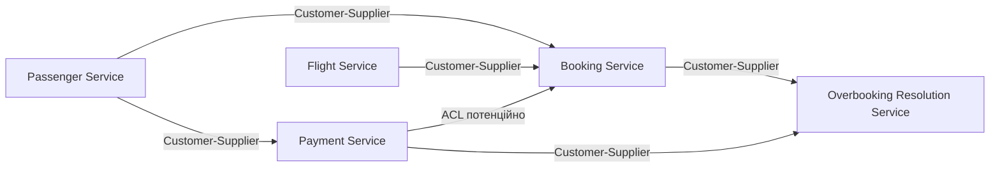

# Проєкт: Система продажу авіаквитків з динамічним ціноутворенням та овербукінгом

---

## 1. Предметна область

Предметною областю визначено букінг, а саме продаж авіаквитків із динамічним ціноутворенням і контрольованим овербукінгом.

Ціна квитка залежить від заповненості рейсу та кількості днів до вильоту: що вищий попит, то вища ціна. Паралельно система продає квитків трохи більше, ніж є фізичних місць, компенсуючи очікувану частку пасажирів, які не з'являться на рейс (no-show). Якщо в день вильоту підтверджених пасажирів виявляється більше, ніж місць, частина бронювань знімається з рейсу з грошовою компенсацією.

Для узгодження розподілених транзакцій між сервісами застосовується патерн SAGA. Оплата симулюється: реальний рух коштів не використовується, а відмова платежу виникає з невеликою заданою ймовірністю (наприклад, 10–15% запитів).

---

## 2. Наскрізні сценарії

### Сценарій 1: Бронювання квитка (happy path)

1. Надсилається запит на бронювання до Booking Service.
2. Створюється бронювання зі статусом `PENDING`.
3. Виконується запит до Flight Service для отримання поточної розрахованої ціни.
4. Виконується запит на резервацію місця у Flight Service; місце атомарно позначається як зайняте.
5. Ціна фіксується в бронюванні як знімок стану (`priceAtBooking`) на момент операції.
6. Виконується запит до Payment Service на списання коштів.
7. За умови успішної оплати статус бронювання оновлюється на `CONFIRMED`.

### Сценарій 2: Компенсація при відхиленій оплаті (SAGA rollback)

1. Кроки 1–5 Сценарію 1 виконуються ідентично — місце вже зарезервоване.
2. Payment Service повертає статус `DECLINED`.
3. Надсилається запит на звільнення місця до Flight Service (`release-seat`).
4. Статус бронювання оновлюється на `FAILED`.

### Сценарій 3: Розв'язання овербукінгу

1. Overbooking Resolution Service ініціює перевірку рейсу перед вильотом.
2. Запитується список підтверджених бронювань з Booking Service.
3. Запитується фізична місткість рейсу з Flight Service.
4. За умови перевищення місткості обираються кандидати на зняття (за критерієм часу купівлі).
5. Для кожного кандидата статус бронювання оновлюється на `BUMPED`.
6. Ініціюється запит на компенсацію до Payment Service (`refund`).
7. Формується звіт по рейсу (`OverbookingReport`).

---

## 3. Bounded Contexts

| Сервіс | Ключові бізнес-об'єкти |
|---|---|
| **Passenger Service** | Passenger, SavedPaymentMethod |
| **Flight Service** | Flight, Seat, Fare, Inventory |
| **Booking Service** | Booking, Passenger, Ticket, Reservation |
| **Payment Service** | Payment, Refund |
| **Overbooking Resolution Service** | OverbookingReport, Bumped Passenger, Compensation Case |

Ціноутворення не виноситься в окремий bounded context — вхідні дані для розрахунку (кількість проданих місць, дата вильоту) належать Flight Context, і виділення окремого сервісу додало б синхронний мережевий виклик без зміни в моделі даних чи ритмі змін.

---

## 4. Ізоляція даних

**Passenger Context**

`Passenger`

| Поле | Пояснення |
|---|---|
| id | ідентифікатор пасажира |
| fullName | ПІБ пасажира |
| email | контактна електронна пошта |
| phone | контактний телефон |
| documentNumber | номер документа, що посвідчує особу |
| savedPaymentMethodId | ідентифікатор емульованого способу оплати (умовний, без реальних платіжних даних) |

**Flight Context**

`Flight`

| Поле | Пояснення |
|---|---|
| id | ідентифікатор рейсу |
| flightNumber | номер рейсу |
| origin | аеропорт відправлення |
| destination | аеропорт призначення |
| departureTime | дата й час вильоту |
| totalSeatsEconomy | загальна кількість місць економ-класу |
| totalSeatsBusiness | загальна кількість місць бізнес-класу |
| basePriceEconomy | базова ціна економ-класу |
| basePriceBusiness | базова ціна бізнес-класу |

`Inventory`

| Поле | Пояснення |
|---|---|
| flightId | посилання на рейс |
| seatsSoldEconomy | кількість проданих місць економ-класу |
| seatsSoldBusiness | кількість проданих місць бізнес-класу |
| overbookingLimitPercent | дозволений відсоток продажу понад фізичну місткість |

**Booking Context**

`Booking`

| Поле | Пояснення |
|---|---|
| id | ідентифікатор бронювання |
| flightId | посилання на рейс |
| passengerId | посилання на пасажира у Passenger Context |
| passengerName | ім'я пасажира, зазначеного в бронюванні |
| ticketClass | клас квитка (economy/business) |
| status | статус бронювання (PENDING/SEAT_RESERVED/CONFIRMED/FAILED/BUMPED) |
| priceAtBooking | ціна, зафіксована на момент бронювання |
| reservationId | ідентифікатор резервації місця у Flight Context |
| paymentId | посилання на платіж у Payment Context |
| purchaseTime | час оформлення бронювання |

**Payment Context**

Оплата симулюється: реальні платіжні дані та фактичний рух коштів не використовуються. Payment Service імітує відповідь зовнішнього платіжного провайдера (`SUCCESS`/`DECLINED`) за простим внутрішнім правилом, без інтеграції з банком чи платіжною системою.

`Payment`

| Поле | Пояснення |
|---|---|
| id | ідентифікатор платежу |
| bookingId | посилання на бронювання |
| paymentMethodId | посилання на емульований спосіб оплати у Passenger Context |
| amount | сума операції |
| status | статус платежу (SUCCESS/DECLINED) |
| type | тип операції (CHARGE/REFUND) |

**Overbooking Resolution Context**

`OverbookingReport`

| Поле | Пояснення |
|---|---|
| id | ідентифікатор звіту |
| flightId | посилання на рейс |
| bumpedBookingIds | список бронювань, знятих через овербукінг |
| totalCompensationPaid | загальна сума виплаченої компенсації |
| resolvedAt | час завершення перевірки |

Точки збереження зрізів:

- Booking Context: поле `passengerId` фіксується як посилання на пасажира в момент створення бронювання; повна модель Passenger (Passenger Service) у цьому контексті не відтворюється.
- Booking Context: поле `priceAtBooking` фіксується в момент виклику `POST /bookings` на основі поточної ціни Flight Context; подальші зміни ціни на рейс на вже створене бронювання не впливають.
- Payment Context: поля `bookingId` та `amount` фіксуються станом на момент запиту оплати; поле `paymentMethodId` — посилання на спосіб оплати з Passenger Context, самі платіжні дані Payment Service не зберігає.
- Overbooking Resolution Context: список бронювань (`id, purchaseTime, status`) і місткість рейсу (`totalSeats`) фіксуються станом на момент запуску перевірки.

---

## 5. Context Map

Стрілка йде від upstream-контексту (постачальника моделі) до downstream-контексту (споживача). Payment Service позначений потенційним Anti-Corruption Layer стосовно Booking Service, оскільки моделює межу із зовнішнім платіжним провайдером.
