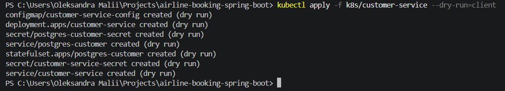
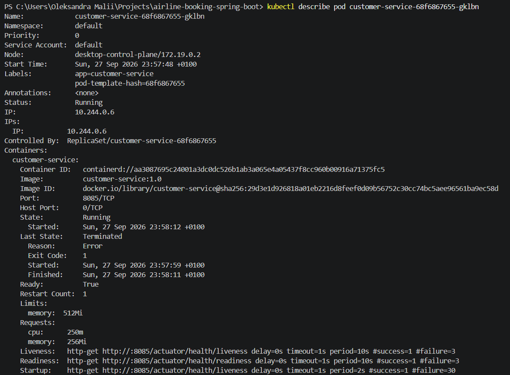
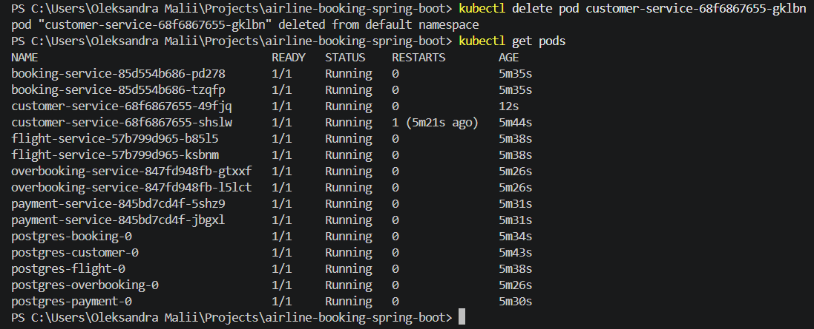

# Звіт з розгортання системи в Kubernetes

## Архітектура

У системі п'ять сервісів: `customer-service`, `flight-service`, `booking-service`, `payment-service`, `overbooking-service`. Кожен запущений окремим `Deployment` на дві репліки, і в кожного своя база Postgres на `StatefulSet` з окремим диском. Спільних баз немає, кожен сервіс ходить тільки у свою.

| Сервіс | Порт | База даних |
|---|---|---|
| customer-service | 8085 | customer_db |
| flight-service | 8081 | flight_db |
| booking-service | 8082 | booking_db |
| payment-service | 8083 | payment_db |
| overbooking-service | 8084 | overbooking_db |

Сервіси й бази не з'єднуються по IP, бо він міняється щоразу, як под перестворюється. Замість цього кожен має `Service` типу `ClusterIP`, і за ним закріплена стала DNS-адреса, наприклад `postgres-customer:5432`.

Базу зробили через `StatefulSet`, а не `Deployment`, бо диск не можна втрачати при перезапуску. `StatefulSet` тримає `PersistentVolumeClaim` прив'язаним до конкретного пода, і той нікуди не зникає, навіть коли под перестворюється.

Щоб Kubernetes розумів, живий застосунок чи ні, у кожен сервіс додали `spring-boot-starter-actuator` і ввімкнули `management.endpoint.health.probes.enabled=true`. Це відкриває два маршрути. `/actuator/health/liveness` показує, чи не завис процес, і якщо перевірка провалюється, под перезапускається. `/actuator/health/readiness` показує, чи готовий сервіс приймати трафік, і якщо ні, його тимчасово прибирають з балансування без перезапуску. Ще додали `startupProbe`, щоб Spring Boot встиг повністю піднятись і `livenessProbe` не вбила под завчасно.

На ресурси кожного контейнера поставили `requests` і `limits` на пам'ять. Ліміт на CPU не ставили навмисно, бо інакше JVM тротлиться на старті й під час збирання сміття.

## Структура маніфестів

Усі маніфести лежать у `k8s/`, по папці на кожен сервіс. У кожній папці сім файлів, і в кожного своя роль.

**`deployment.yaml`** задає 2 репліки, образ виду `customer-service:1.0`, усі три проби на `/actuator/health/...` і ресурсні `requests`/`limits`. Змінні середовища контейнер бере не напряму, а через `envFrom`, яка підтягує весь `configmap.yaml` і весь `secret.yaml` сервісу.

**`service.yaml`** створює `ClusterIP` з тим самим іменем, що й сервіс, і `selector` за міткою `app`, який прив'язує його до подів цього `Deployment`.

**`configmap.yaml`** тримає прості пари ключ-значення: `SPRING_PROFILES_ACTIVE`, `SERVER_PORT`, `DB_URL`, `DB_USER`.

**`secret.yaml`** тримає одне значення, `DB_PASSWORD`, у форматі `stringData`.

**`postgres-statefulset.yaml`** розгортає базу як `StatefulSet` з `volumeClaimTemplates`, який монтує окремий диск у `/var/lib/postgresql/data`, тож дані не пропадають при перестворенні пода. Готовність перевіряється командою `pg_isready`, а не HTTP-запитом.

**`postgres-service.yaml`** — headless-сервіс (`clusterIP: None`) з DNS-іменем бази, наприклад `postgres-customer`, як і прийнято для `StatefulSet`.

**`postgres-secret.yaml`** тримає `POSTGRES_DB`, `POSTGRES_USER`, `POSTGRES_PASSWORD`, якими Postgres ініціалізується при першому запуску.

Конфіги й паролі винесли окремо від Docker-образу, тож щоб змінити параметр чи пароль, образ перезбирати не треба.

## Підтвердження працездатності

Перед тим як розгортати в кластері, маніфести прогнали в режимі dry-run.

```
kubectl apply -f k8s/customer-service --dry-run=client
```



Далі застосували маніфести в кластері для кожного сервісу.

```
kubectl apply -f k8s/customer-service
```

Одразу після apply частина подів ще піднімається (`ContainerCreating`), а через хвилину всі переходять у `Running` — це видно нижче, на скріншоті після перевірки самовідновлення.

І перевіряємо, що проби на готовність проходять:



На цьому скріншоті видно `Restart Count: 1` — под один раз перезапустився ще до того, як стати `Ready`, і саме для цього потрібен `startupProbe`. Зараз под `Running` і `Ready: True`.

Щоб перевірити, що система й справді сама відновлюється, а не тільки на словах, видалили один под вручну.

```
kubectl delete pod customer-service-68f6867655-gklbn
```



На цьому ж скріншоті видно всі 15 подів (5 сервісів по дві репліки і 5 баз) у стані `1/1 Running`.

Наостанок перевірили, що сервіс відповідає, через проброс порту.

```
kubectl port-forward pod/<назва_пода> 8085:8085
```


